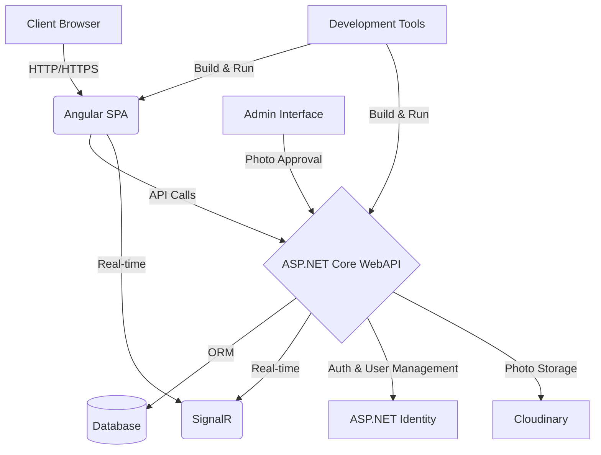

# Soul Crush

## Overview
SoulCrush is a application built from scratch using ASP.NET Core WebAPI and Angular. This Single Page Application (SPA) offers a seamless user experience with real-time functionality, secure authentication, and an intuitive interface.
It's an exciting project that showcases modern web development practices.

## Tech Stack
- **Backend**: ASP.NET Core WebAPI
- **Frontend**: Angular
- **Real-time Communication**: SignalR
- **UI Framework**: Bootstrap
- **Authentication**: ASP.NET Identity with JWT (JSON Web Tokens)
- **ORM**: Entity Framework Core
- **Cloud Storage**: Cloudinary for photo uploads
- **Database**: SQL Server
  
## Key Features
- **User Authentication**: Secure login and registration functionalities.
- **Private Messaging**: Users can send and receive messages in real time using SignalR.
- **Photo Uploads and Galleries with gallery view**: Users can upload photos and create dynamic galleries.
- **Enhanced UI/UX**: Beautiful user interface designed with Bootstrap and third-party components.
- **Dynamic Routing**: Secure navigation using Angular routing.
- **Form Handling**: Utilizes both Angular Template Forms and Reactive Forms with validation.
- **Paging, Sorting, and Filtering**: Optimized performance for better user experience.
- **Photo management**: Admin functionality for approval of uploaded images.

## Architecture

